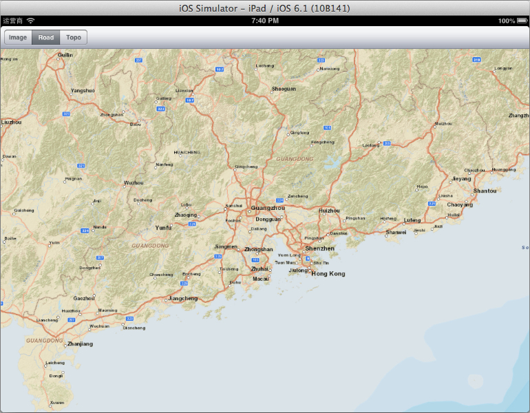
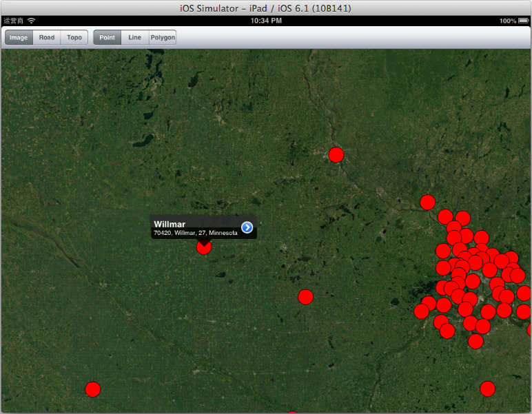

# MonoTouch.ArcGIS

[ArcGIS Runtime SDK for iOS][1] Version 10.1.1 Update 1 (Apr 2013) binding to MonoTouch.

## Support Features

This project is very early state， only support a few features following:

- AGSTiledMapServiceLayer
- AGSDynamicMapServiceLayer (not completed yet)
- AGSGraphicsLayer
- AGSFeatureLayer

Other features need to be added, please wait or add them by yourself.

## Build the Binding project and run test

1. Login to ESRI Online, download and install ArcGIS Runtime SDK **ArcGIS Runtime SDK for iOS v10.1.1 Update 1**, the file downloaded should be **AGSRuntimeSDKiOSv10.1.1-u1.pkg**.
2. Clone this repository to local, for example `~/Projects/MonoTouch.ArcGIS`
3. Copy file `~/Library/SDKs/ArcGIS/iOS/ArcGIS.framework/Versions/Current/ArcGIS` to Binding project folder, and rename it to `libArcGIS.a`
4. Rebuild the Binding project first, if no errors occured, then build the AGSTestCS Project.
5. Run the AGSTestCS

## Usage and Tutorial

- Check ESRI ArcGIS Runtime SDK for iOS [Guide][2].
- Check ESRI ArcGIS Runtime SDK for iOS [API reference][3].
- Check the **AGSTestCS** project in this repository.

## How to add new features

Be aware of those files in the Binding project:

- gen.cs: This file is generated by [Objective Sharpie][4] producted by Xamarin, target with iOS, with the *.h files in the Headers folder. (A file named gen_simulator is also generated, target with iOS Simulator, the two files are same.)
- Api_new.cs: Created by hand, add feature on demand, and try always keep this file can be compiled. 

If you need more ArcGIS Api Features, do as follow steps:

- Locate the interface you needed in the gen.cs;
- Copy the interface defination to gen.cs, if the interface you copyed reference to other interface, copy the referenced to;
- Check and correct those VerifyAttributes generated by Objective Sharpie;
- Try compile the Binding object, ensure there is no error while compiling the project;
- Write some test code in the AGSTestCS project to ensure your new interface works correctly;

### Note:

- After successfly build the Binding project, MonoTouch.ArcGIS.dll is generated, the file size is almost 200MB, because libArcGIS.a is embeded in, so the dll file size is ok;
- After successfly build the AgsTestCS project, the final ipa file is about 7MB, whitch is acceptable.
 
Good luck!

## Still need help

May be Google !

[1]:https://developers.arcgis.com/en/ios/
[2]:https://developers.arcgis.com/en/ios/guide/introduction.htm
[3]:https://developers.arcgis.com/en/ios/api-reference/index.htm
[4]:http://docs.xamarin.com/guides/ios/advanced_topics/binding_objective-c/objective_sharpie